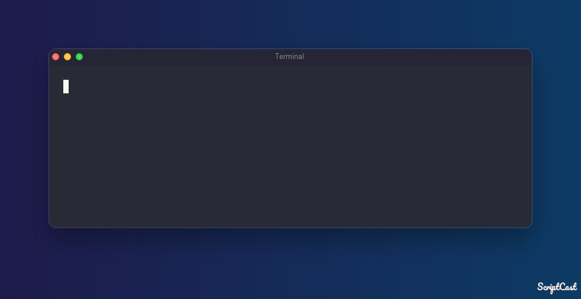
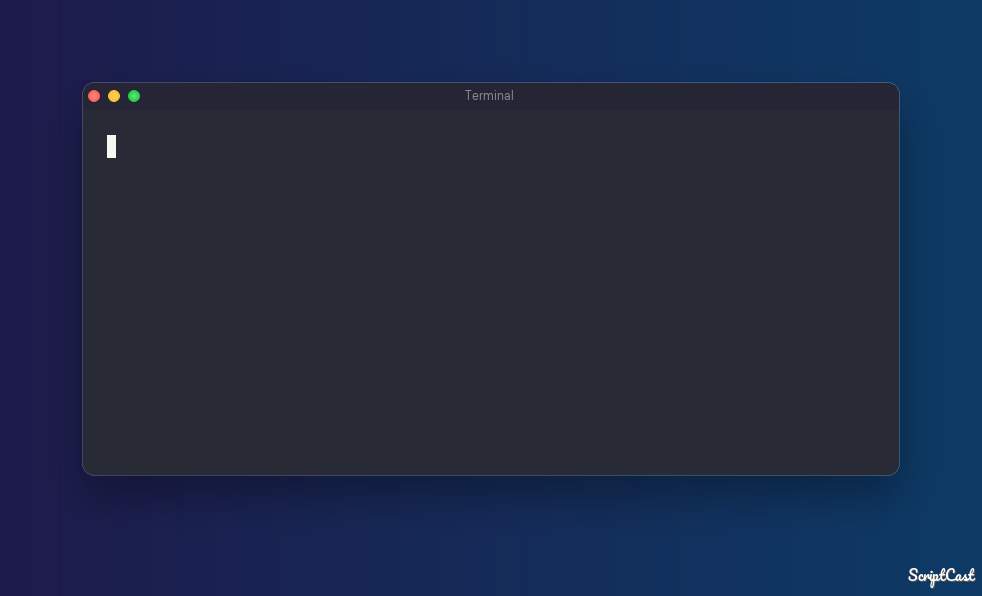
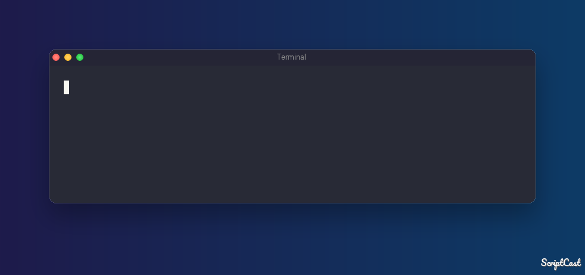
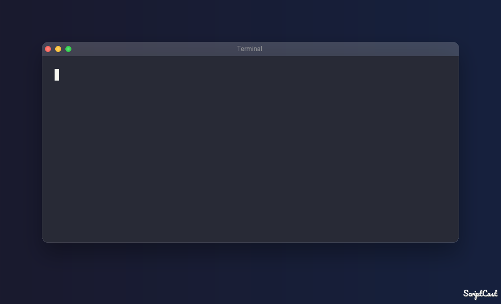
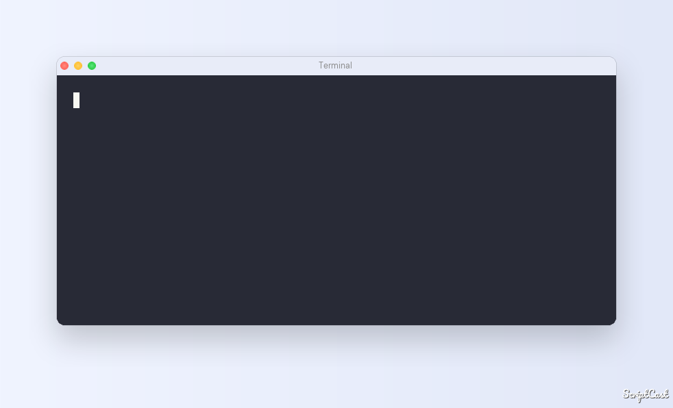

# scriptcast



[](https://github.com/RichardLitt/standard-readme)
[](https://pypi.org/project/scriptcast/)
[](https://github.com/dacrystal/scriptcast/actions)

Generate terminal demos (asciinema casts & GIFs) from annotated shell scripts.

scriptcast turns a shell script into a reproducible, polished terminal demo — with
typing animations, multiple scenes, mocked commands, interactive sessions, output
filtering, and more.

## Table of Contents

- [Background](#background)
- [Install](#install)
- [Usage](#usage)
- [Examples](#examples)
- [Script Syntax](#script-syntax)
- [Similar Projects](#similar-projects)
- [Contributing](#contributing)
- [License](#license)

## Background

Terminal demos are hard to reproduce. Screen recordings drift, manual re-runs produce
different output, and polishing timing or hiding sensitive paths requires video editing.

scriptcast treats demos as code. You write a shell script annotated with `SC`
directives — controlling scenes, typing speed, mocked commands, interactive expect
sessions, and output filters — then run a two-stage pipeline:

1. **Record** — the script executes with shell tracing enabled; raw output is captured
   and written to a JSONL `.sc` file containing timestamped `cmd`, `output`, `input`,
   and `directive` events.
2. **Generate** — the `.sc` file is read by a streaming renderer that synthesises a
   polished asciinema `.cast` file with typing animations and timing.

The `.sc` file is plain text, version-controllable, and diffable. Re-generating a cast
from an existing `.sc` is instant.

## Install

```bash
pip install scriptcast
```

Requires Python 3.10+. For GIF output, install [agg](https://github.com/asciinema/agg).

### From source

```bash
git clone https://github.com/dacrystal/scriptcast.git
cd scriptcast
pip install -e .
```

## Usage

```bash
scriptcast demo.sh          # record → generate → export (PNG by default)
scriptcast demo.sc          # generate → export (skip record)
scriptcast demo.cast        # export only

scriptcast --no-export demo.sh   # record + generate only, no image
scriptcast --format gif demo.sh  # export as GIF (requires agg)
scriptcast install               # install agg binary and fonts
```

Key flags:

| Flag | Default | Description |
|------|---------|-------------|
| `--output-dir PATH` | same dir as input | Where to write output files |
| `--no-export` | off | Stop after generating `.cast`; skip image export |
| `--format [gif\|png]` | `png` | Export format |
| `--theme TEXT` | `dark` | Built-in theme name or path to `.sh` theme file |
| `--directive-prefix PREFIX` | `SC` | Directive prefix used in scripts |
| `--trace-prefix CHAR` | `+` | PS4/xtrace prefix |
| `--shell PATH` | `$SHELL` | Shell used for recording |
| `--split-scenes` | off | Write one `.cast` file per scene |
| `--xtrace-log` | off | Save raw xtrace capture to `<stem>.xtrace` |

## Examples

**`examples/showcase.sh`** — a realistic three-scene demo: interactive login, mocked deploy, status check with filter.



**`examples/tutorial.sh`** — one scene per directive: mock, expect, filter, comment, sleep, word\_speed, record pause/resume.



### Themes

Built-in themes: `dark` (default), `aurora`, `light`. Pass `--theme <name>` or a path to a custom `.sh` theme file.

| `--theme dark` | `--theme aurora` | `--theme light` |
|:---:|:---:|:---:|
|  |  |  |

## Script Syntax

Scripts are valid shell scripts. `SC` directives are embedded as shell no-ops
(`: SC ...`) so they execute harmlessly but appear in the xtrace output for the
recorder to process.

```sh
#!/usr/bin/env scriptcast

# Global config — applied before any scene
: SC set type_speed 40
: SC set width 80
: SC set height 24

# ── Scene: intro ──────────────────────────────
: SC scene intro

echo "Hello from scriptcast"

# ── Scene: mock ───────────────────────────────
: SC scene mock

: SC mock deploy <<'EOF'
Deploying to production...
Build: OK
Tests: OK
Deploy: OK
EOF

deploy

# ── Scene: expect ─────────────────────────────
: SC scene expect

: SC expect ./my-app <<'EOF'
expect "Password:"
send "secret\r"
expect "prompt>"
send "quit\r"
expect eof
EOF

# ── Scene: filter ─────────────────────────────
: SC scene filter

: SC filter sed 's#/home/user/projects#<project>#g'

pwd

# ── Scene: comment ────────────────────────────
: SC scene comment

: SC '\' This is a visual comment
echo "comments appear as prompt lines in the cast"

# ── Scene: setup (not recorded) ───────────────
: SC scene setup

: SC record pause
DB_URL="postgres://localhost/mydb"
: SC record resume

echo "Connecting to $DB_URL"
```

### Recorder directives

These are consumed during recording and never appear in the `.sc` file.

| Directive | Description |
|-----------|-------------|
| `SC mock <cmd> <<'EOF'` ... `EOF` | Mock `<cmd>` so it prints fixed output during recording |
| `SC expect <cmd> <<'EOF'` ... `EOF` | Run an interactive session via [expect(1)](https://core.tcl-lang.org/expect/index) |
| `SC record pause` | Stop capturing output (commands still execute) |
| `SC record resume` | Resume capturing |
| `SC filter <cmd> [args...]` | Replace the current output filter with a shell command (stdin→stdout) |
| `SC filter-add <cmd> [args...]` | Append a command to the current filter chain |
| `SC '\' <text>` | Emit a `# text` comment line in the cast (visual annotation) |
| `SC helpers` | Inject ANSI color variables (`RED`, `YELLOW`, `GREEN`, `CYAN`, `BOLD`, `RESET`) silently into the script |

#### `SC expect` syntax

The heredoc body is a standard expect script. scriptcast preprocesses it to capture
typed input and clean up spawn noise. Inputs sent with `send` are recorded as `input`
events; silent inputs (e.g. passwords read with `read -rs`) produce silent animations.

```sh
: SC expect ./fake-db <<'EOF'
expect "Password:"
send "secret\r"
expect "mysql>"
send "show databases;\r"
expect eof
EOF
```

### Generator directives

These are stored in the `.sc` file and interpreted during cast generation.

| Directive | Description |
|-----------|-------------|
| `SC scene <name>` | Start a new scene |
| `SC set <key> <value>` | Set a timing or display config key |
| `SC sleep <ms>` | Pause for N milliseconds |

### Config keys (`SC set`)

| Key | Default | Description |
|-----|---------|-------------|
| `type_speed` | `40` | ms per character when typing commands |
| `cmd_wait` | `80` | ms after a command is typed, before output |
| `input_wait` | `80` | ms to pause before typing interactive input |
| `enter_wait` | `80` | ms at the start of each scene, after clearing |
| `exit_wait` | `120` | ms after the last output line of a scene |
| `width` | `100` | Terminal width (columns) |
| `height` | `28` | Terminal height (rows) |
| `prompt` | `$ ` | Prompt string shown before commands |
| `word_speed` | same as `type_speed` | Extra ms pause after each space when typing |
| `cr_delay` | `0` | ms between `\r`-split segments (for progress-bar animations) |

When using ANSI escape sequences in `prompt`, use ANSI-C quoting so the shell
interprets the escapes before scriptcast sees them:

```sh
: SC set prompt $'\033[92m> \033[0m'
```

## Similar Projects

- [VHS](https://github.com/charmbracelet/vhs) — declarative `.tape` DSL for scripted terminal recordings; outputs GIF, MP4, WebM
- [Terminalizer](https://github.com/faressoft/terminalizer) — record a live terminal session and render it as a GIF or HTML player
- [asciinema_automation](https://github.com/PierreMarchand20/asciinema_automation) — automate asciinema recordings using pexpect and comment directives
- [demo-magic](https://github.com/paxtonhare/demo-magic) — bash function library for simulated typing in live terminal presentations

**What makes scriptcast different:**

- **Shell-script-native** — the demo source is a real, runnable `.sh` file, not a DSL or config format. Directives are no-op shell comments that execute harmlessly.
- **Two-stage pipeline** — `record` and `generate` are separate. Re-rendering with different timing or themes is instant, no re-recording needed.
- **Version-controllable** — the `.sc` file is plain JSONL, diffable and reviewable in git.
- **Mocking and expect** — `SC mock` and `SC expect` let you script slow, side-effectful, or interactive commands without running the real thing.
- **Output filters** — `SC filter` pipes captured output through any shell command to scrub paths, tokens, or hostnames before they reach the cast.

## Contributing

Issues and pull requests are welcome at
[github.com/dacrystal/scriptcast](https://github.com/dacrystal/scriptcast/issues).

Before opening a PR, ensure:
- All tests pass: `uv run pytest`
- New behaviour is covered by tests

## License

MIT © dacrystal
